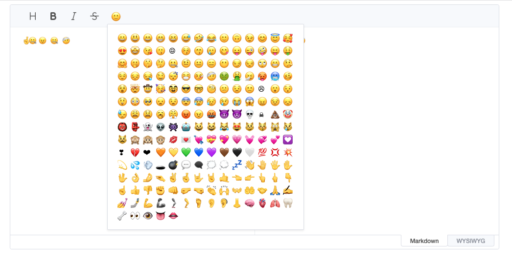

# ToastUI Editor Emoji

emoji for tui.editor

[Demo link is here.](https://erzh.github.io/tui.editor-emoji/demo.html)

## screenshot


## usage
### step 1: add style
```html
<link rel="stylesheet" href="https://uicdn.toast.com/editor/3.2.1/toastui-editor.css" />
<style>
.editor-emoji-popup span {
    display: inline-block;
    font-size: 16px;
    margin: 5px;
    line-height: 1;
    width: 16px;
    text-align: center;
    cursor: pointer;
}
</style>
```

### step 2: add javascript library
```html
<script src="https://uicdn.toast.com/editor/3.1.2/toastui-editor-all.min.js"></script>
<script src="https://erzh.github.io/tui.editor-emoji/lib/tui.editor-emoji.js"></script>
```

### step 3: use emoji for tui.editor

```html
<div id="editor"></div>
<script>
    const editor = new toastui.Editor({
        el: document.querySelector('#editor'),
        previewStyle: 'vertical',
        toolbarItems: [
            ['heading', 'bold', 'italic', 'strike']
        ],
        height: '500px',
    });
    // use emoji for tui.editor
    useTuiEditorEmoji(editor)
</script>
```

### reference
emoji code from: https://unicode.org/emoji/charts/full-emoji-list.html

[https://erzh.github.io/tui.editor-emoji/]: https://erzh.github.io/tui.editor-emoji/
